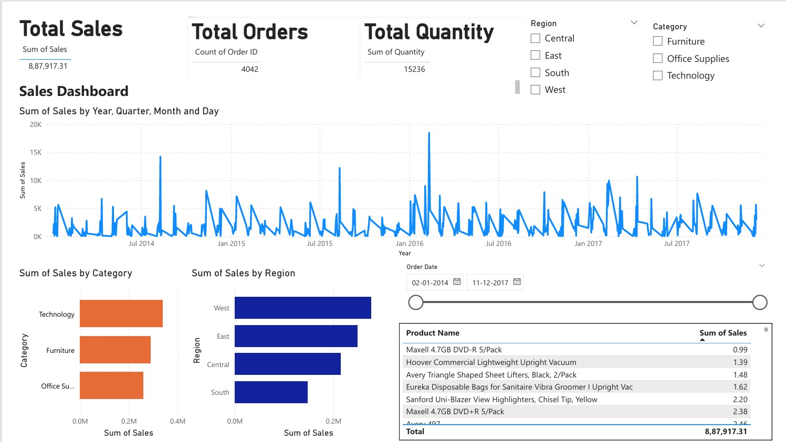

# 📊 Sales Performance Dashboard — Power BI

> Data Analytics Project focused on dashboard development, KPI reporting, and business insights using Power BI & Excel

---

## 📸 Dashboard Preview

---

## 📌 Project Overview

Developed an interactive Sales Performance Dashboard in Power BI to analyze revenue, orders, and regional performance.

The project focuses on **data cleaning, data analysis, and dashboard development** to support **data-driven decision making**.

**Domain:** Retail Sales  
**Role Simulated:** Data Analyst | Business Analyst | Reporting Analyst  

---

## 📊 Key Business Metrics

| Metric | Value |
|--------|------|
| 💰 Total Revenue | ₹8.87L+ |
| 📦 Total Orders | 4,000+ |
| 📈 Units Sold | 15,000+ |
| 🗺️ Coverage | Multi-region |

---

## ✅ Features & Analysis

- KPI Dashboard — Revenue, Orders, Quantity tracking  
- Sales Trend Analysis — Monthly performance insights  
- Category & Product Analysis — Top-performing segments  
- Regional Analysis — Region-wise comparison  
- Interactive Filters — Dynamic slicers for analysis  

---

## 🔍 Business Insights

- Identified top revenue-generating product categories  
- Analyzed monthly sales trends and peak periods  
- Compared regional performance to highlight gaps  
- Observed relationship between orders and revenue  

---

## 🛠 Tech Stack & Skills

- Power BI Desktop  
- DAX (Basic Measures & Calculations)  
- Power Query (Data Cleaning / ETL)  
- Microsoft Excel  
- Data Analysis  
- Data Visualization  
- KPI Reporting  
- MIS Reporting  

---

## 📂 Repository Structure
powerbi-sales-dashboard/

│

├── Sales_Dashboard.pbix

├── Sales_Dashboard.pdf

├── Dashboard.png

└── README.md

---

## 📬 Connect With Me

- 📧 Email: pravalikagunaganti16@gmail.com  
- 💼 LinkedIn: https://linkedin.com/in/pravalika-gunagantiti-5a333a304  
- 🐙 GitHub: https://github.com/pravalikagunaganti  

💡 Open to Data Analyst / Business Analyst / Operations roles

